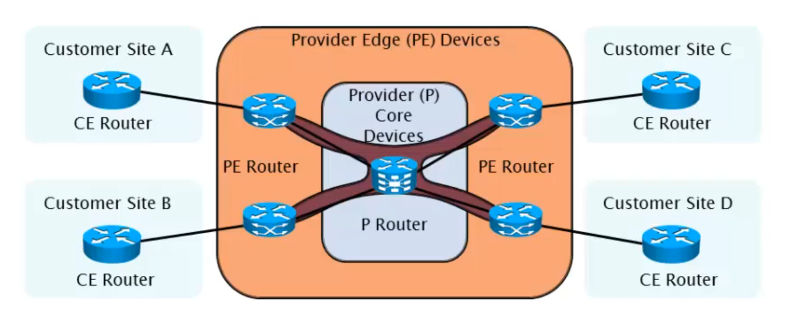
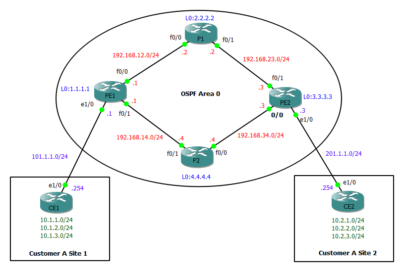
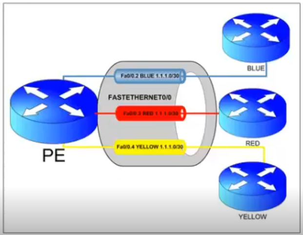
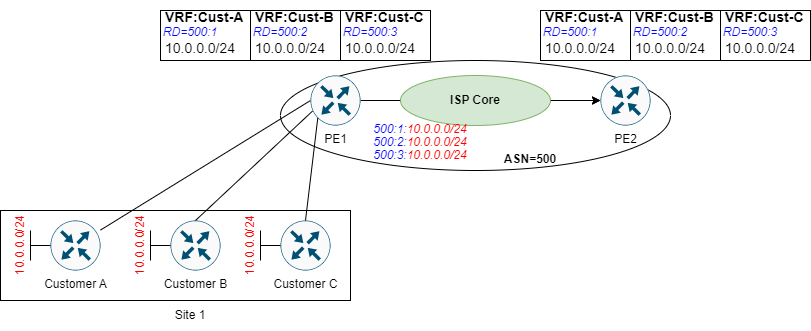
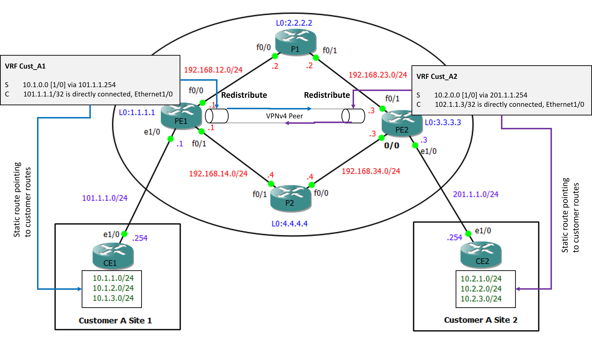

# Introduction

* MPLS VPN forwards packets based on _labels_ instead of IP addresses. It combines the best of both Overlay and Peer-to-peer model.
* Customer routes are placed in seperate VRF routing table at the PE router. 
* A VPNv4 Peering takes place between two PE router.
* PE routers also runs iBGP for building a full-mesh topology between all PE routers. 
* MPLS VPN provides a BGP free core. 



# MPLS VPN Configuration Steps

Following steps to configure MPLS VPN 
1. Configure IGP inside the SP core.
2. Configure MPLS and LDP inside the SP core.
3. Create VRF for each customer and assign Route Distinguisher (RD)  and Route Target (RT) values.
4. Configure VPNv4 peering between both the PE routers.
5. Configure routing between PE and CE
    * Option 1: Static/Default 
    * Option 2: IGP (EIGRP, OSPF, ISIS)
    * Option 3: BGP
6. Redistribute customer routes into iBGP at the PE routers 

# Step 1 & 2: IGP and MPLS configuration at the ISP  

## Topology 


## Service Provider configuration 
### PE-1 Router 
```
!PE1
conf t
	!! interface config 
	int f0/0
		ip add 192.168.12.1 255.255.255.0
		ip ospf network point-to-point
		no sh
	int f0/1
		ip add 192.168.14.1 255.255.255.0
		ip ospf network point-to-point
		no sh
	int l0
		ip add 1.1.1.1 255.255.255.0
		ip ospf network point-to-point
	
	!! IGP config 
	router os 1
		pass def
		router-id 1.1.1.1
		net 192.168.0.0 0.0.255.255 area 0
		net 1.1.1.1 0.0.0.0 area 0 		!for LDP
		no pass f0/0	
		no pass f0/1
	exit
	
	!! MPLS Config 
	mpls label range 100 199
	mpls ldp router-id loop0
	int range f0/0-1
		mpls ip 
	exit
end
```
### PE-2 Router 
```
PE2
conf t
	!! interface config 
	int f0/0
		ip add	192.168.34.3 255.255.255.0
		ip ospf network point-to-point
		no sh
	int f0/1
		ip add 192.168.23.3 255.255.255.0
		ip ospf network point-to-point
		no sh
	int l0
		ip add 3.3.3.3 255.255.255.0
		ip ospf network point-to-point
	
	!! IGP config 
	router os 1
		pass def
		router-id 3.3.3.3
		net 192.168.0.0 0.0.255.255 area 0
		net 3.3.3.3 0.0.0.0 area 0 		!for LDP
		no pass f0/0	
		no pass f0/1
	exit
	
	!! MPLS Config 
	mpls label range 300 399
	mpls ldp router-id loop0
	int range f0/0-1
		mpls ip 
	exit
end 
```
### P-1 Router 
```
!P1
conf t
	!! interface config 
	int f0/0
		ip add	192.168.12.2 255.255.255.0
		ip ospf network point-to-point
		no sh
	int f0/1
		ip add 192.168.23.2 255.255.255.0
		ip ospf network point-to-point
		no sh
	int l0
		ip add 2.2.2.2 255.255.255.0
		ip ospf network point-to-point
	
	!! IGP config 
	router os 1
		pass def
		router-id 2.2.2.2
		net 192.168.0.0 0.0.255.255 area 0
		net 2.2.2.2 0.0.0.0 area 0  		!for LDP
		no pass f0/0	
		no pass f0/1
	exit
	
	!! MPLS Config 
	mpls label range 200 299
	mpls ldp router-id loop0
	int range f0/0-1
		mpls ip 
	exit
end 
```
### P-2 Router
```
!P2
conf t
	!! interface config 
	int f0/0
		ip add	192.168.34.4 255.255.255.0
		ip ospf network point-to-point
		no sh
	int f0/1
		ip add 192.168.14.4 255.255.255.0
		ip ospf network point-to-point
		no sh
	int l0
		ip add 4.4.4.4 255.255.255.0
		ip ospf network point-to-point
	
	!! IGP config 
	router os 1
		pass def
		router-id 4.4.4.4
		net 192.168.0.0 0.0.255.255 area 0
		net 4.4.4.4 0.0.0.0 area 0  		!for LDP
		no pass f0/0	
		no pass f0/1
	exit
	
	!! MPLS Config 
	mpls label range 400 499
	mpls ldp router-id loop0
	int range f0/0-1
		mpls ip 
	exit
end 
```

# Step 3: VRF Configuration

## Virtual Routing and Forwarding (VRF)
Keeping all routes coming from multiple customer may cause conflict when multiuple customer advertises routes from same address range. Previously, the customer segregation was done by ACLs. However, ACL based segrigation is not scalable. VRF provides virtulizing the RIB into many logical RIBs associated with physical interfaces pointing to the respective customer. One VRF can contain multiple interfaces but one interface can't be part of multiple VRFs.

* VRF isolates customer specific routes into a virtual routing table in a PE router alongside its global routing table.
* Logical isolation at the RIB and CEF isolates VRF FIBs at the hardware level.
* VRF solves the complexity of legacy ACL based traffic segregation. 
* Route leaking between VRFs is not allowed by default. 

## Route Distinguisher (RD) value 


Let the PE1 receives exact same route (`10.0.0.0/24`) from three of its customer. As the customer facing interfaces are different, the router segregates the routes into their respecrive VRFs to prevent any route leaking. However, when the routes will be redistributed into the MP-BGP for VPNv4 tunnelling between PE1 and PE2. How does PE2 segrigates the routes into the corresponding VRF?

The problem is raising as when the routes are advertised into BGP the prefixes loose their uniqueness. To make the prefixes unique, additional information needs to be attached with them what helps them identifieable at the far end of the tunnel. This additional information that distingusihes customer route across the provider core is called route distingusher or RD. 

* 64 bit (8 Bytes) prepended prefix, used to convert a client's non-unique 32-bit IPv4 address into an unique $64+32=96$ bits VPNv4 address to enable transport between PE routers.
* The resultant address is called a VPNv4 address.
* RD is locally significant to a router.
* A VRF is not operational unless an RD is configured.
* RD format: `ASN:nn` or `A.B.C.D:nn`.
* Each VRF in a PE router must have an unique RD. 
 

## Route Target (RT) value

* 64-bit Extented BGP Community that is attached to a VPNv4 BGP route to indicate its VPN membership.
* Any number of RTs can be attached to a single route.
* __Export RTs__:
    * Identifies the VPN membership to which the associated VRF belongs to.
    * Are attached to a client route when converting it into a VPNv4 route.
* __Import RTs__:
    * Used to select which VPNv4 routes are to be inserted into which VRF tables.
    * On the receiving PE router, a route is imported into its VRF only if at least one RT attached to the route matches at least one import RT configured on that VRF. 

## VRF Configuration template

```
conf t
    vrf definition {VRF_NAME}           ! create a VRF 
        rd {ASN:NN}                     ! set RD
        address-fam {ipv4 | ipv6}       ! VPNv4 or VPNv6 
            route-target {import | export | both} {ASN:NN}  ! set RT
        exit
    exit

    int {IFACE}
        ip vrf forwarding {VRF_NAME}    ! apply VRF to the customer facing interface 
        ip add {IP_ADDR} {MASK}         ! VRF association removes interface IP
        no sh
    exit
end 
```
<hr>

```
!! verification
sh ip vrf [detail] {VRF_NAME}           ! vrf config
sh ip route vrf {VRF_NAME}              ! VRF routing table  
sh ip vrf interface                     ! VRF to interface mapping   
```

## Configure Customer & Static Default Route at CE1 and CE2 routers

### CE1
```
conf t
    !! Gateway interface
    int e1/0
        ip add  101.1.1.254 255.255.255.0   !set static IP 
        no sh

    !! customer routes 
    int l1
        ip add 10.1.1.1 255.255.255.0
    int l2
        ip add 10.1.2.1 255.255.255.0
    int l3  
        ip add 10.1.3.1 255.255.255.0
    exit

    !! Default route 
    ip route 0.0.0.0 0.0.0.0 101.1.1.1      !static default route 
end 
```
### CE2
```
conf t
    !! Gateway interface
    int e1/0
        ip add  201.1.1.254 255.255.255.0   !set static IP 
        no sh

    !! customer routes 
    int l1
        ip add 10.2.1.1 255.255.255.0
    int l2
        ip add 10.2.2.1 255.255.255.0
    int l3  
        ip add 10.2.3.1 255.255.255.0
    exit

    !! Default route 
    ip route 0.0.0.0 0.0.0.0 201.1.1.3      !static default route 
end 
``` 

## Configure PE1 and PE2

* In the following configuration creates the VRF `CUST_A1` and `CUST_A2` VRFs at the `PE1` and `PE2` routers for the cutomer A site 1 and 2 respectively.
* For the Customer A we assign the RD and RT value `500:1` where `500` is the ASN of the SP and the customer A is identified as `1`.  
* While applying VRF on an interface, it removes the IP configuration. 

### PE1
```
conf t
    !! VRF definition 
    vrf definition CUST_A1      ! VRF for customer A site 1 
        description vrf for cust 1 site 1
        rd 500:1                ! SP ASN=500 customer id=1
        address-fam ipv4
            route-target both 500:1 ! recommanded to use same RT for all customer sites
        exit
    exit

    !! applying VRF to interface
    int e1/0
        vrf forwarding CUST_A1  ! apply vrf 
        ip add 101.1.1.1 255.255.255.0
        no sh 
    exit

    !! static routes from customer A site 2
    ip route vrf 10.1.0.0 255.255.0.0 101.1.1.254
end
```
<hr>

```
sh ip vrf [detail] CUST_A1    ! verify 
```

### PE2
```
conf t
    !! VRF definition 
    vrf definition CUST_A2      ! VRF for customer A site 1 
        description vrf for cust 1 site 2
        rd 500:1                ! SP ASN=500 customer id=1
        address-fam ipv4
            route-target both 500:1 ! recommanded to use same RT for all customer sites
        exit
    exit

    !! applying VRF to interface 
    int e1/0
        vrf forwarding CUST_A2  ! apply vrf  
        ip add 201.1.1.1 255.255.255.0
        no sh
    exit

    !! static routes from customer A site 2
    ip route vrf 10.2.0.0 255.255.0.0 201.1.1.254
end
```
<hr>

```
sh ip vrf [detail] CUST_A2    ! verify 
```

## Verify PE-CE reachability
while testing reachability fromt the PE to CE the normal ping will not work as it uses the global routing table. To generate the ping from a VRF use the `ping vrf {VRF_NAMR} {DEST_ADDR}` command.  

```
ping vrf CUST_A1 1
01.1.1.254   !from PE1 to CE1
ping vrf CUST_A1 102.1.1.254   !from PE2 to CE2
```


# Step 4: VPNv4 peering between PE routers 



* The VPNv4 peering is a iBGP peering with the VPNv4 address family. 
* iBGP must be configured at all the PE routers between their loopback intefaces. 
* The P routers don't need any BGP configuration which results in a BGP free core at the ISP. 

## VPNv4 Configuration 
1. Create an __IBGP peering__ between the PE routers 
    1. disable the default ipv4 unicast address family to avoid creating unncecesary IPv4 peering.
    2. initiate an iBGP neighbourship to the remote loopback.
    3. source the peering from local loopback 
2. Create __VPNv4 tunnel__ over the iBGP peering. (_Mnemonic: ASN_)
    1. Enter into the VPNv4 Unicast address-family
    2. activate the BGP negotiation process manually, non-default AF requires neighbourship activation. 
    3. The route-target values are carried by the extended BGP community.  
    4. Keep the next-hop value as self to keep the PE IP address as source at the BGP update. MPLS will use this IP to find the optimal LSP. 

```
!PE
conf t
    router bgp {ASN}        ! start iBGP process with SP's ASN
        no bgp default ipv4-unicast  ! negate the defalt ipv4 address family (optional but recommanded)
        
        !! do the following for all PEs to create a full-mesh iBGP peering   
        nei {PE_LOOPBACK_ADDR} remote-as {ASN}      ! point to far side PEs' loopback
        nei {PE_LOOPBACK_ADDR} update-source loop0  ! source the tunnel from local loopback 

        !! VPNv4 peering (ASN rule: Activate, Send-Community ext, next-hop-self)
        address-family vpnv4 unicast
            nei {PE_LOOPBACK_ADDR} activate                   ! activate specific vpnv4 neighborship 
            nei {PE_LOOPBACK_ADDR} send-community extended    ! to carry the RT values from source VRFs  
            nei {PE_LOOPBACK_ADDR} next-hop-self              ! to point the source PE  
        exit
    exit
end
```

<hr>

```
!! Verify neighbourship
sh bgp vpnv4 unicast all summary
```


### PE1 Router
```
conf t
    router bgp 500
        no bgp default ipv4-unicast
        nei 3.3.3.3 remote as 500
        nei 3.3.3.3 update-source loop0

        address-family vpnv4 unicast 
            nei 3.3.3.3 activate 
            nei 3.3.3.3 send-community extended 
            nei 3.3.3.3 next-hop-seld
        exit
    exit
end
```

### PE2 Router
```
conf t
    router bgp 500
        no bgp default ipv4-unicast
        
        nei 1.1.1.1 remote as 500
        nei 1.1.1.1 update-source loop0

        address-family vpnv4 unicast 
            nei 1.1.1.1 activate 
            nei 1.1.1.1 send-community extended 
            nei 1.1.1.1 next-hop-seld
        exit
    exit
end
```

## Verification
```
!PE1
sh bgp vpnv4 unicast all summary

BGP router identifier 1.1.1.1, local AS number 500
BGP table version is 1, main routing table version 1

Neighbor        V           AS MsgRcvd MsgSent   TblVer  InQ OutQ Up/Down  State/PfxRcd
3.3.3.3         4          500      29      29        1    0    0 00:23:19        0
```
<hr>

```
!PE2
sh bgp vpnv4 unicast all summary

BGP router identifier 3.3.3.3, local AS number 500
BGP table version is 1, main routing table version 1

Neighbor        V           AS MsgRcvd MsgSent   TblVer  InQ OutQ Up/Down  State/PfxRcd
1.1.1.1         4          500      32      32        1    0    0 00:26:32        0
```

# PE-CE redistribution

* The PE to CE Redistribution is bidirectional when customer routes are advertised to the PE routers via dynamic routing protocol. 
* For Static routes its from static to iBGP.

```
conf t
    router bgp 500
        address-family ipv4 vrf CUST_A1
            redistribute connected
            redistribute static 
        exit
    exit
exit
```
<hr>

```
sh ip vrf route CUST_A1 
```
