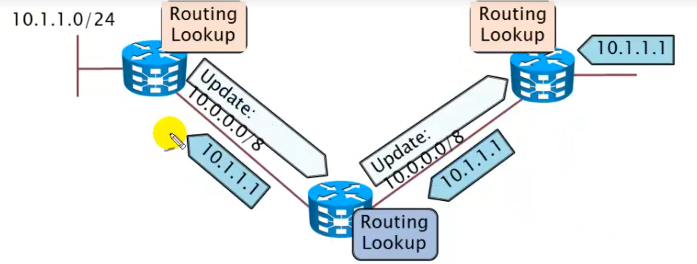
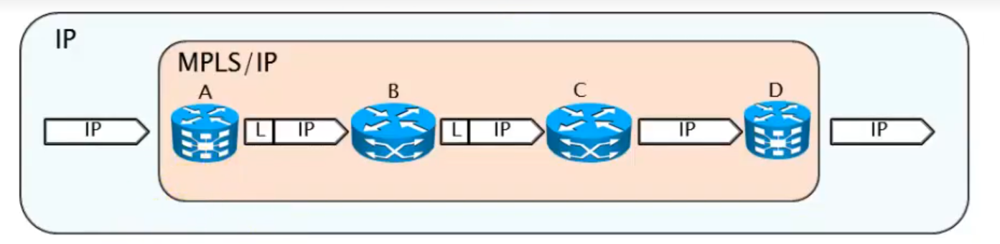
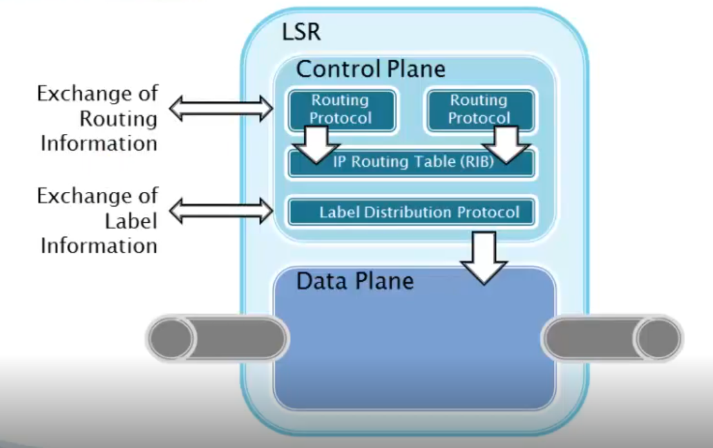
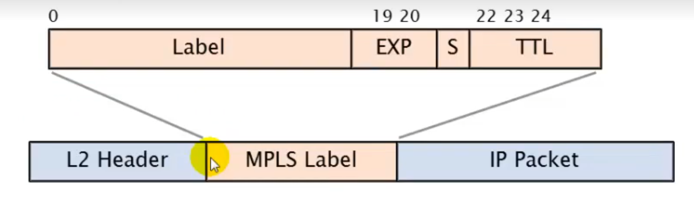
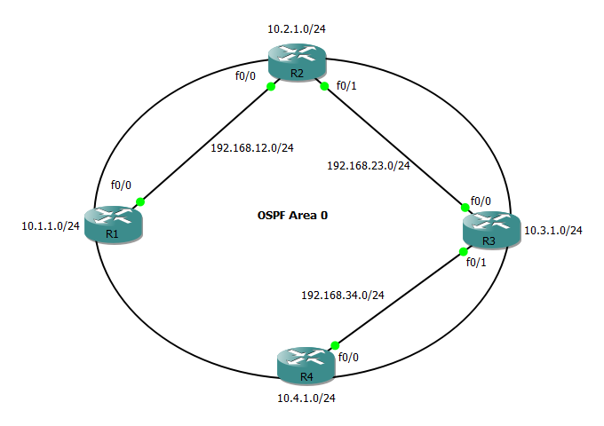
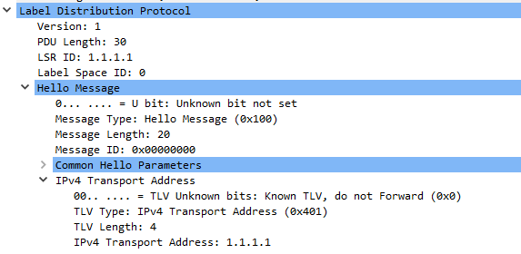
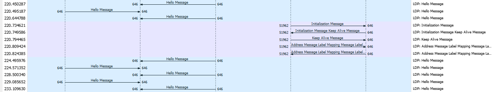
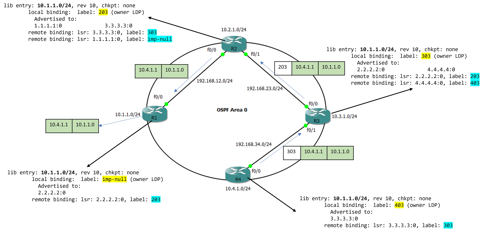

# Introduction 

## Topics to cover
1. Traditional IP Routing 
2. Basic MPLS Features
3. Cisco Express Forwarding (CEF)
4. MPLS Technology 
5. Benifits of MPLS


## Traditional IP Routing 

* Routing protocol provides the control plane to distribute routing information. 
* Forwarding decission is made based on 
    * Packet header 
    * Local routing table 
* Routing lookups are idependently perfermed as a per-hop-behaviour. 

IP Routing is a prerequisite for MPLS to work, as the Label Information Base (LIB) is derived from the Routing Information Base (RIB).

## Basic MPLS Feature 

1. Packets enter into the SP nework as a normal IP Packet through the PE router.
2. The PE router __pushes__ a label into the packet. 
3. __Label Distribution__: The LDP protocol distributes the labels among other participating routers
3. __Label Switching__: Intermediate (P) routers switches labes and forward the packet across the SP core.
4. __Multi-protocol__: MPLS packets can be carried on any L2 protocol.  
4. The far-side PE Router __pops__ the label and releases normal IP Packet (_The actual pop happens at the penlatimate router to the PE, called Penaltimate Hop Poppoing (PHP)_)
7. Label lookup is incurs less overhead compared to traditional 

## Cisco Express Forwarding 



## MPLS Terminologies
1. __Label Switch Router (LSR)__: Forward packets based on label and swap label. 
2. __Edge LSR__: PE rouuters running MPLS
    * Labels IP packets and forward them into MPLS domain (__Ingress LSR__).
    * Forward IP packet out of the MPLS domain (__Egress LSR__) 
3. __Label Switched Path (LSP)__: A sequence of labels to reach a destination. 

## Benifits of MPLS
1. Supports unicast and multicast routing 
2. Redues forwarding overhead on the core routers
3. BGP-free core
4. Supports forwarding of non-IP packets
5. Application: VPN, Traffic Tengineering with QoS (MPLS-TE) 

# MPLS Labels and Stacks


## MPLS Label
* MPLS labels are 4Bytes (32 bits) inserted by the core router between L2 and L3 headers. 
    * 20-bits __Label__ 
    * 3-bits __Experimental__ bits for QoS
    * 1-bit Bottom-of-Stack (__BOS__) indicator: There could be multiple labels injected into a packet, e.g., one for route identification and another for QoS marking. The `BOS = 0` is there are more level to pop.  
    * 8-bit __TTL__: Prevents loop in the LSP
* Labels are locally significant, each LSR uses its local label to forward packets.
* A single Label corresponds to single route and share them with MPLS neighbour using the LDP protocol.    

## Label Stack
* Usually ony one label is assigned to a packet but multiple labels in a lable stack are suppported.
* The following scenarios may produce more than one label:
    1. __MPLS VPN__ (2 labels): 
        * The top Label points to the egress router. 
        * The bottom label identifies the VPN.
    2. __MPLS TE__ (2 or more labels):
        * Top label points to the endpoint of the traffic engineering tunnel
        * Bottom label points to the destination.
    3. __MPLS VPN + TE__ (three or more label)  
        * Top label point the TE endpoint 
        * Next label ropints to the egress router.
        * Bottom label identifies the VPN   

# Label Distribution Protocol (LDP)

* MPLS don'tforward based on the labels automatically. 
* MPLS control plane for sharing labels using LDP within the SP-Core. 
* All routers in the SP domain must be configured with LDP; all interfaces for the P routers and the Core-facing interfaces for the PE routers. 
* __The LDP family__:
    1. __Tag Distribution Protocol__
        * Cisco Prop
        * Depricated (not used anymore)
        * TCP port 711
    2. __Label Distribution Protocol__
        * Standard Based
        * Default on Cisco Routers 
        * UDP port 646
    3. __RSVP__
        * Used for MPLS-TE labels. 

# LDP Configuration 

## Topology 


## Base Config 
The following two must satisfy to proceed with LDP configuration.
1. CEF is enabled, verigy using `show ip cef` command.
2. IGP is enabled, verify using `show ip protocol` command. OSPF and IS-IS are the most commonly used IGP within the ISP network because they are LSRP and the MPLS-TE is only supported by them.
 
### Router 1
```
conf t
	!! interface config 
	int f0/0
		ip add 192.168.12.1 255.255.255.0
		ip ospf network point-to-point
		no sh
	int e1/0
		ip add 10.1.1.1 255.255.255.0
		no sh
	int l0
		ip add 1.1.1.1 255.255.255.0    
	exit

	!! IGP config 
	router os 1
		router-id 1.1.1.1
		pass def 
		net 192.168.0.0 0.0.255.255 area 0
		net 10.0.0.0 0.255.255.255 area 0
		net 1.1.1.1 0.0.0.0 area 0   ! LDP reachability 
		no pass f0/0
	exit
end 
```

### Router 2
```
conf t
	!! interface config 
	int f0/0
		ip add 192.168.12.2 255.255.255.0
		ip ospf network point-to-point
		no sh
	int f0/1
		ip add 192.168.23.2 255.255.255.0
		ip ospf network point-to-point
		no sh
	int e1/0
		ip add 10.2.1.1 255.255.255.0
		no sh
	int l0
		ip add 2.2.2.2 255.255.255.0

	!! IGP config 
	router os 1
		router-id 2.2.2.2
		pass def 
		net 192.168.0.0 0.0.255.255 area 0
		net 10.0.0.0 0.255.255.255 area 0
		net 2.2.2.2 0.0.0.0 area 0   ! LDP reachability 
		no pass f0/0
		no pass f0/1
	exit
end 
```

### Router 3
```
conf t
	!! interface config 
	int f0/0
		ip add 192.168.23.3 255.255.255.0
		ip ospf network point-to-point
		no sh
	int f0/1
		ip add 192.168.34.3 255.255.255.0
		ip ospf network point-to-point
		no sh
	int e1/0
		ip add 10.3.1.1 255.255.255.0
		no sh
	int l0
		ip add 3.3.3.3 255.255.255.0

	!! IGP config 
	router os 1
		router-id 3.3.3.3
		pass def 
		net 192.168.0.0 0.0.255.255 area 0
		net 10.0.0.0 0.255.255.255 area 0
		net 3.3.3.3 0.0.0.0 area 0   ! LDP reachability 
		no pass f0/0
		no pass f0/1
	exit
end 
```

### Router 4
```
conf t
	!! interface config 
	int f0/0
		ip add 192.168.34.4 255.255.255.0
		ip ospf network point-to-point
		no sh
	int e1/0
		ip add 10.4.1.1 255.255.255.0
		no sh
	int l0
		ip add 4.4.4.4 255.255.255.0

	!! IGP config 
	router os 1
		router-id 4.4.4.4
		pass def 
		net 192.168.0.0 0.0.255.255 area 0
		net 10.0.0.0 0.255.255.255 area 0
		net 4.4.4.4 0.0.0.0 area 0   ! LDP reachability 
		no pass f0/0
	exit
end 
```

## LDP Config 

__LDP RID__: LDP uses router-id similar to OSPF (pref: manual > highest loopback > heighest active interface). However, LDP requires the RID to be reachable. 
1. Therefore, it is not recommaned to let the LDP process to choose a RID. 
2. Rather, create loopback specific for LDP peering and advertise them in the IGP. 
3. Finally explicitly set the LDP router-id by poining the loopback.  



```
!! LDP & MPLS base config
conf t
    mpls label protocol ldp       ! activate LDP (optional)
    mpls label range {MIN} {MAX}  ! set the range of label to use (Router specific) 
    mpls ldp router-id loop 0     ! identifies each router must be reachable 
    int {IFACE}                   ! for all core facing interface
        mpls ip                   ! activate MPLS
    exit
end 
```

### Verification 
1. Verify the LDP neigbours `show mpls ldp nei`
    ```
     Peer LDP Ident: 2.2.2.2:0; Local LDP Ident 1.1.1.1:0
        TCP connection: 2.2.2.2.51962 - 1.1.1.1.646
        State: Oper; Msgs sent/rcvd: 19/19; Downstream
        Up time: 00:04:55
        LDP discovery sources:
          FastEthernet0/0, Src IP addr: 192.168.12.2
        Addresses bound to peer LDP Ident:
          192.168.12.2    192.168.23.2    10.2.1.1        2.2.2.2
    ```
2. Verify MPLS enabled interfaces `show mpls interface`
    ```
    Interface              IP            Tunnel   BGP Static Operational
    FastEthernet0/0        Yes (ldp)     No       No  No     Yes
    ```
3. Verify the LIB `show mpls ldp binding [{NET_ID} {CIDR}] [detail]`
    ```
      lib entry: 1.1.1.1/32, rev 2
        local binding:  label: 16
        remote binding: lsr: 4.4.4.4:0, label: 16
        remote binding: lsr: 2.2.2.2:0, label: 16
      lib entry: 2.2.2.0/24, rev 26
            remote binding: lsr: 2.2.2.2:0, label: imp-null
     
     ! output ommited

      lib entry: 192.168.34.0/24, rev 22
            local binding:  label: imp-null
            remote binding: lsr: 4.4.4.4:0, label: imp-null
            remote binding: lsr: 2.2.2.2:0, label: 22
    ```

# MPLS Label Forwarding 

MPLS label forwarding works using the 5 steps:
1. IGP builds the RIB (CEF dumps RIB into FIB).
2. LSR assigns a local label for each route learned.
3. LSR shares the labels with neighbours using LDP.
4. LSR build local LIB (CEF dumps LIB into LFIB).
5. LSR uses LFIB lookup to forward packets.

The LSP finding process of the network `10.1.1.0/24` from Router `R4` is given below.


## Verification
### Trace LSP
Verify the LSP using `traceroute` command and check how the labels are switched. 
```
R4#trace 10.1.1.1 source 10.4.1.1

Type escape sequence to abort.
Tracing the route to 10.1.1.1
VRF info: (vrf in name/id, vrf out name/id)
  1 192.168.34.3 [MPLS: Label 303 Exp 0] 64 msec 80 msec 92 msec
  2 192.168.23.2 [MPLS: Label 203 Exp 0] 88 msec 28 msec 56 msec
  3 192.168.12.1 96 msec 92 msec 80 msec
```
### Check LFIB 
check the LFIB entris using `show mpls forwarding table [NET_ID]`
* __R4__
  ```
  Local      Outgoing   Prefix           Bytes Label   Outgoing   Next Hop
  Label      Label      or Tunnel Id     Switched      interface
  
  403        303        10.1.1.0/24      0             Fa0/0      192.168.34.3
  ```
* __R3__
  ```
  Local      Outgoing   Prefix           Bytes Label   Outgoing   Next Hop
  Label      Label      or Tunnel Id     Switched      interface
  
  303        203        10.1.1.0/24      950           Fa0/0      192.168.23.2
  ```
* __R2__
  ```
  Local      Outgoing   Prefix           Bytes Label   Outgoing   Next Hop
  Label      Label      or Tunnel Id     Switched      interface

  203        Pop Label  10.1.1.0/24      1242          Fa0/0      192.168.12.1
  ```
* __R1__
  ```
  Local      Outgoing   Prefix           Bytes Label   Outgoing   Next Hop
  Label      Label      or Tunnel Id     Switched      interface
  
  None       No Label   10.1.1.0/24      0             punt
  ```


